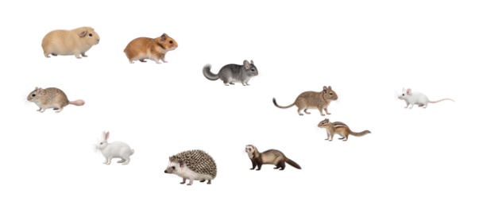

# MofuMouse

写真風の小動物がマウスカーソルについてくる、Windows／Mac向けの先行版です。

[Webでおためし](https://udteach.github.io/MofuMouse/try/) · [ダウンロードと使い方](https://udteach.github.io/MofuMouse/download.html) · [v0.1.0-preview.2](https://github.com/UDteach/MofuMouse/releases/tag/v0.1.0-preview.2)



10種・26種類を収録し、デグーは全10色が選べます。1〜10匹を表示して、1匹ずつ種類と毛色を指定できます。大きさは32／48／64／96px。マウスの速さに合わせて歩き、止まると待機します。動物はクリックを遮りません。通知領域／メニューバーから設定・一時停止・終了できます。

Windows 10／11 x64はインストーラーEXEとZIP。MacはmacOS 13以降の通常版とmacOS 12向け互換版があり、Apple Silicon／Intel別にDMGとZIPを配布します。macOS 11以前、Windows32bit／ARMは対象外です。

Windowsで表示と操作を確認しています。MacはCIビルド・構成・署名整合性を確認しますが、実機での表示・操作とMontereyの起動は未確認です。Windowsコード署名、Apple Developer ID署名・公証は未実施です。[確認状況と初回起動](https://udteach.github.io/MofuMouse/download.html#support)

## 開発とビルド

Node.js 24を使います。

```sh
cd electron-prototype
npm ci
npm run check
npm start
```

Windows上で `npm run dist:win`、Mac上で `npm run dist:mac` と `npm run dist:mac:monterey` を実行します。出力先は `release-build/` と `release-build-macos12/`。動物素材はレビュー済みの固定PNG列を同梱し、起動時にもhashを確認します。

Webデモはルートで `node scripts/build-web-demo.mjs` を実行し、`docs/` をHTTPサーバーで開きます。デモとアプリは追従計算と同じPNGを使い、デモはページ内だけに表示します。

[開発手順](electron-prototype/README.md) · [今回の更新](docs/publishing/preview-release-notes.md) · [公開手順](docs/publishing/README.md)

ほかの動物の追加色は制作中で、歩行のコマ数は種類によって異なります。この版は全色の制作完了を意味しません。旧Go版のソースは保持しています。[旧版README](docs/legacy-go-readme.md)
