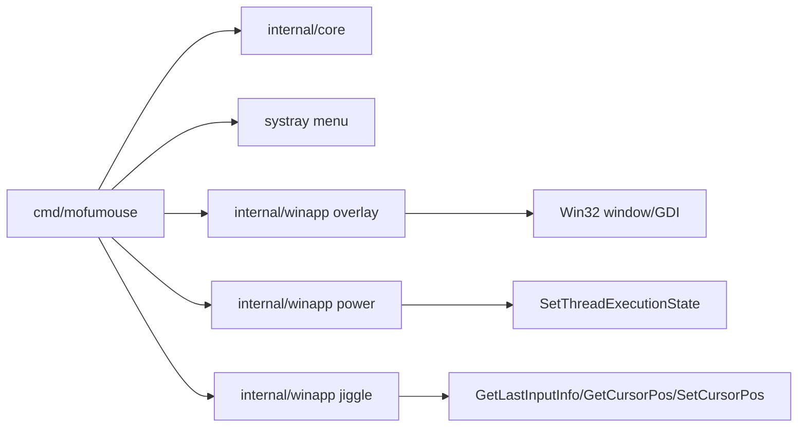

# MofuMouse Degu Edition 設計 v0.1

作成日: 2026-06-20

## 目標

MofuMouse は「カーソルの横でアシストしてくれるデグー版チューチューマウス」として作る。懐かしい自動カーソル支援の価値を残しつつ、現代 Windows で危険になりやすい自動クリック、パスワード露出、監視回避的な挙動は入れない。

## 機能マッピング

| チューチューマウス系の機能 | MofuMouse の設計 | 初期実装 |
| --- | --- | --- |
| ボタンへ走る | 候補ボタンを見つけ、デグーが鼻先で探るしぐさで知らせる。設定時のみカーソル移動する。 | クラシック Win32 + x64 UI Automation の sniff assist と既定OFFの物理移動まで実装 |
| 元の位置へ戻る | 移動後に元位置へ戻す、または軌跡だけ表示する。 | 既定OFFで実装。ユーザーが動かしたら戻さない |
| AI 学習 / 飼育手帳 | アプリ/ウィンドウ/ボタン別に優先・除外をローカル保存する。内容ログは残さない。 | `TargetRules` と Control Center のルール編集を実装 |
| クイックスクロール | トレイから現在のウィンドウを少量だけ上下スクロールする。カーソル付近の一時ハンドルは後続polish。 | MVP |
| クイックキー | 安全なショートカットだけを近接パレット化する。 | 固定allowlistをトレイから実行 |
| IE ナビ | ブラウザ共通の戻る/進む補助に置き換える。 | 後続 |
| 勝手にアクティブ | 遅延付き hover activate。初期値 OFF。 | 後続 |
| どこでもスタートメニュー | デスクトップ/空白領域 gesture でランチャーを出す。 | 後続 |
| ガバットデスクトップ | Win+D 相当の show desktop / restore。 | 部分実装 |
| 画面端ワープ | マルチモニター対応の edge warp。初期値 OFF。 | 部分実装 |
| 自動起動 | サインイン時にMofuMouseを始める。初期値 OFF。 | HKCU Runキーで実装 |
| みえみえパスワード | 実装しない。Caps Lock 警告や password manager 補助に置換。 | 対象外 |
| おやすみ / バイバイ | 一時停止/終了、プロセス別自動停止。 | MVP |
| 見た目設定 | 毛色、サイズ、名前表示、動きの強さ。 | 毛色/サイズ/名前表示は実装。鳴き声は現在の仕様から削除 |
| スクリーンセーバー防止 | OS Keep Awake と 1px jiggle を分ける。 | MVP |

## MVP

MVP は次の体験に限定する。

- カーソル横にデグー風 overlay が出る。
- overlay はクリックを奪わず、常に手前に表示される。
- トレイからアシスト表示、OS Keep Awake、1px ジグルを切り替えられる。
- 名前、無操作アクション、画面端ワープ、クラシック操作をトレイ/設定で扱える。
- `--smoke` で短時間起動し、動作確認できる。
- Windows x86 / x64 の両方でビルドできる。
- 正式なデグー素材は必ず ImageGen で生成する。MVP の GDI 描画はプレースホルダー。

## アーキテクチャ



## 主要コンポーネント

- `internal/core`: 設定、状態、表示文言、安全なデフォルト。
- `internal/winapp`: Windows 専用の overlay、keep awake、jiggle。
- `cmd/mofumouse`: tray、CLI、起動/終了、各サービスの接続。
- Win32 interop は `uintptr` を使い、x86/x64 の pointer size 差に依存しない。
- Main app startup calls `SetProcessDpiAwarenessContext(PER_MONITOR_AWARE_V2)` with older Windows fallbacks, so overlay and cursor helpers use physical monitor coordinates instead of DPI-virtualized positions.
- 公開 workflow は release 前に有効化する。現時点では `docs/publishing` のテンプレートに置く。

## アセット設計

正式素材は ImageGen 生成物だけを採用する。パースを安定させるため、sprite sheet ではなく個別 PNG と manifest で管理する。必要な初期セットは次の通り。

- tray icon: active / sleepy / keep-awake
- cursor buddy sprite: idle / walk / run / guard / sniff / sleepy
- reaction sprite: sniff / groom / dig / dust bath / alarm
- coat variants: agouti / gray / dark / cream / pied / white

MVP の Win32/GDI 描画は、overlay と click-through の動作確認用プレースホルダーとしてのみ残す。素材パイプラインは `assets/source` の ImageGen 原本、`assets/sprites` の加工済み個別 PNG、`assets/manifest/assets.json` の対応表で管理する。

## 安全ルール

- 自動クリックはしない。
- Delete / Pay / Send / Publish などの危険操作は将来の target assist でも自動移動対象にしない。
- パスワードを表示・取得・記録しない。
- 1px ジグルと Keep Awake は常にユーザーが見えるトレイ状態を持つ。
- 終了時に power request を解除する。
- ユーザー入力中はカーソル移動しない。

## 技術選定

長期的には C# / WPF または WinUI が最も自然。現時点では `dotnet` が未導入で、Go が利用可能なため、最初の動く MVP は Go + Win32 API で作る。MVP の体験が固まったら、UI Automation と設定画面の複雑さを見て C# へ移すか判断する。

## 動作確認

```powershell
go test ./...
go build -ldflags="-H=windowsgui" -o mofumouse.exe ./cmd/mofumouse
GOARCH=386 go build -ldflags="-H=windowsgui" -o dist\mofumouse-x86.exe ./cmd/mofumouse
GOARCH=amd64 go build -ldflags="-H=windowsgui" -o dist\mofumouse-x64.exe ./cmd/mofumouse
.\mofumouse.exe --smoke
```
## 2026-06-20 UX/Asset Update

- Cursor buddy は既定 32px。画面上で主張しすぎないことを優先する。
- 既定オフセットは cursor 真横の `4,-22`。sprite 左端が cursor のすぐ右、縦中心が cursor 付近に来るように置く。
- 右端では自動的に cursor 左側へ反転し、仮想スクリーン境界内に clamp する。
- pet name は設定として保持するが、overlay では既定非表示。必要なときだけ `ShowPetName` で表示する。
- カーソル移動直後は idle action より movement frame を優先する。移動中は `walk` / `run`、静止中は `idle` / `nibble` / `groom` / `patpat` / `sniff` / `sleepy` / `dig` / `roll` を使う。TargetReturn で元位置へ戻した直後だけ `return` を短時間優先する。
- Keep Awake または 1px jiggle が有効な静止中は `guard` / `idle` / `guard` の短い sequence で状態を示す。
- 追従位置は cursor 座標へ即時ジャンプさせず、30Hz timerごとに補間して近づける。真横から離れにくいよう catch-up は強め、大きく離れた場合だけスナップする。
- 1px jiggle は仮想スクリーン内で右へ 1px 動かし、右端では左へ 1px 動かす。負の X 座標を持つ左側モニターでも screen外へ出さない。
- 安全な classic Win32 `Button` 候補または x64 UI Automation の `Button` 候補が前面ウィンドウにある時は、カーソル移動表示より後、idle action より前に `sniff` ポーズを優先する。人間的な指差しは使わない。
- 物理カーソル移動は `TargetMove` が明示的にオンの時だけ行う。クリックは行わない。
- `TargetReturn` がオンの時だけ元位置へ戻る。戻る前にユーザーがマウスを動かした場合は戻さない。
- `TargetRules` は前面アプリ名、ウィンドウタイトル、ボタン名の部分一致で候補を優先または除外する。危険ラベル判定済みの候補は、優先ルールでは安全扱いにしない。
- クイックキーは任意入力を受け付けず、固定allowlistだけにする。現時点の許可リストは `Ctrl+F` 検索、`Ctrl+C` コピー、`Ctrl+A` 全選択、`Ctrl+T` 新しいタブ。削除、送信、閉じる、支払いなどのショートカットは入れない。
- x64 UI Automation fallback は goroutine 内で実行し、タイムアウト時はその周期のUIA結果を捨てる。前回のUIA走査がまだ終わっていない場合は新しいUIA走査を開始しない。
- 実アプリQAは Notepad の未保存確認で危険候補除外を確認し、Calculator で `ApplicationFrameHost.exe` 配下の modern Windows app から安全候補を取得できることを確認する。
- 自動起動は `LaunchAtLogin` として設定JSONに保存し、本体の起動/設定再読込/トレイ変更時に HKCU Runキーへ反映する。既定はオフで、QAは実Runキーではなく隔離レジストリキーを使う。
- 更新確認は GitHub Releases API を使い、`runtime.GOARCH` に合う本体 `.exe` / `.zip` を選ぶ。control-center 単体 asset は本体更新として扱わない。手動チェック時は選択assetをユーザーキャッシュ配下の `MofuMouse\updates\<version>` へ一時ファイル経由でダウンロードする。`--install-update` / `--rollback-update` CLI で本体置換とrollbackを実行できる。トレイの「適用して再起動」は native 確認ダイアログを出し、一時コピーした update helper が本体終了を待って置換し、完了後に再起動する。
- 鳴き声は現在の仕様から削除する。`SoundEnabled` / `SoundVolume` / `PlaySoundW` ベースの合成音は使わない。
- `CoatColor` は `agouti` / `gray` / `dark` / `cream` / `white` / `pied`。全色に `idle` / `walk` / `run` を用意し、pose別素材がない毛色は同色idleへフォールバックして、agoutiアクションへの急な色変化を避ける。`return` は現時点では agouti のみ runtime 採用。
- 正式 runtime asset は ImageGen 単品生成だけを採用する。reference sheet の切り抜きは、尻尾・足・ひげが途切れやすいため candidate または style reference に留める。
- runtime 採用前の必須QA: full body not cropped, transparent alpha, 32x32 readability, visual consistency with current agouti runtime set.

## 2026-06-21 UI Architecture Update

ADR: `docs/adr/0002-modern-settings-control-center.md`

The current Win32 settings window is a temporary fallback. It is acceptable for MVP QA, but it should not become the long-term settings surface.

Next architecture:

- Runtime assistant remains Go + Win32:
  - overlay
  - tray
  - cursor tracking
  - keep-awake
  - 1px jiggle
  - x86/x64 builds
- Modern settings/control center uses Wails v2 + React + TypeScript for the x64 control-center executable.
- The first UI component library is Fluent UI React, because the app is Windows-first and needs familiar accessible controls.
- The current runtime keeps the Win32 settings window as a fallback for x86, missing control-center exe, and classic Win32 sniff-assist QA.
- Wails v3 remains watch-list only while the official v3 site marks it alpha.
- WinUI 3 remains the native-Windows v2 candidate if the project later accepts a .NET/C++/Windows App SDK migration.

Control center tabs:

1. Home
2. Companion
3. Assist
4. Keep Awake
5. Appearance
6. Updates
7. Advanced

The Wails control center must read/write the same `core.Settings` model and must not own overlay lifecycle directly. Overlay and helper loops stay in the existing Go runtime services.

Current implementation:

- Root package builds `mofumouse-control-x64.exe` with Wails.
- `cmd/mofumouse` launches the control center from the same directory when available, waits for it to close, then reloads settings.
- `--legacy-settings` forces the old Win32 settings window for QA and fallback.

## 2026-06-21 Runtime Asset Tier Update

Runtime sprites are now generated from ImageGen masters into multiple tiers:

- `assets/sprites/32`
- `assets/sprites/48`
- `assets/sprites/64`
- `assets/sprites/96`

The root `assets/sprites/*.png` 32px files remain for backward compatibility, but the overlay should prefer the nearest larger tier and downscale when possible. This avoids scaling a 32px sprite up to 48/64/96px.

Current limitation:

- Walk/run/dig/roll/sleepy are still low-profile poses. Higher-resolution tiers make them sharper, but do not solve the silhouette mismatch with idle. These poses need ImageGen remake as cursor-buddy poses with more readable body height.
