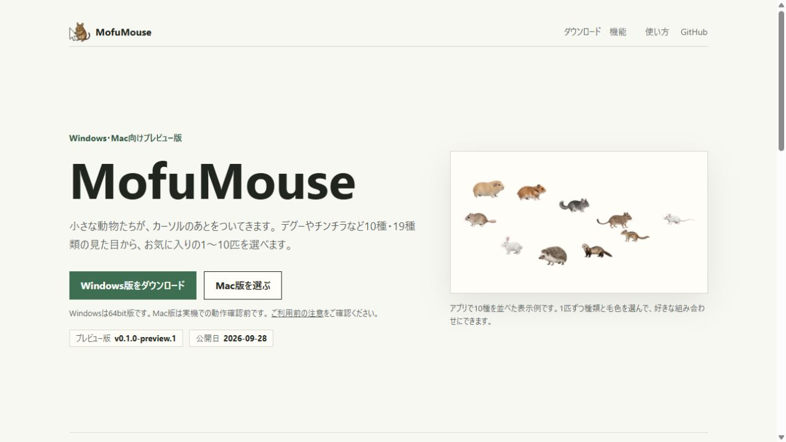
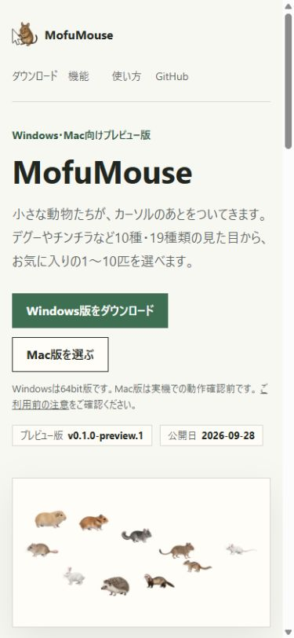
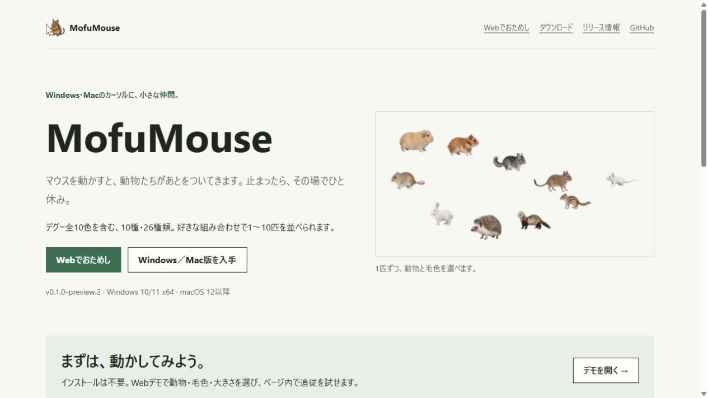
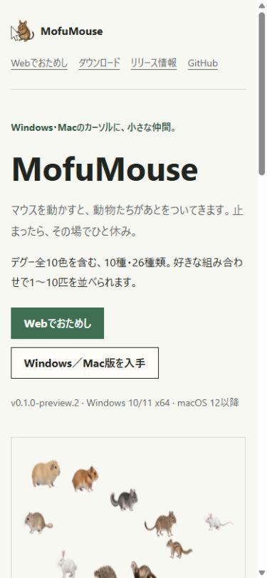

<!-- design-first-ui:v1 -->
# MofuMouse release site design contract

## Status / 状態

- Status: verified
- Owner: MofuMouse project
- Last verified: 2026-10-01
- Target release or task: v0.1.0-preview.2

## Product and primary job / 対象と主目的

- Primary user: Windows/Mac users who want a small animal following their cursor.
- Situation: They arrive from GitHub and need to try the behavior and pick a download.
- One primary job: Try a real animal, then download the correct OS/CPU package.
- Observable success: Working pointer demo, truthful catalog, ten unambiguous distribution links.
- Non-goals: Accounts, analytics, unrelated AnimalsDesktop behavior or the unfinished other forty coats.

## Current evidence / 現状証拠

- Primary interaction tested: Open existing download section and inspect exact six preview.1 links.
- Evidence-backed failures: Static preview; no runnable demo, no separate download journey or Monterey package.
- Existing strengths to preserve: Warm paper, deep green, Japanese copy, real ten-animal image, visible OS limits.

## Constraints / 制約

- Product and business: Preview release; distinguish CI Mac checks from hardware testing.
- Technical and component system: Existing static HTML/JS/CSS and GitHub Pages, no framework or extra service.
- Content and localization: Japanese; technical architecture IDs only where needed for downloads.
- Performance: Reuse the exact H96 PNGs; decode only the currently selected animals; pause in hidden tabs.
- Accessibility: Keyboard controls, status updates, contrast, touch targets and reduced-motion initial pause.
- Supported viewports and devices: 320/390px mobile and default desktop viewport.

## Directions considered / 検討案

### Existing page plus long download section

- Core idea: Append all new information to the old static page.
- Hierarchy and interaction: Hero, old screenshot, ten download links, lengthy instructions.
- Strengths: Familiar; low implementation cost.
- Risks: No primary demo and too much download detail on entry.
- Reference: Current baseline. Rubric 18/24: familiar brand but static interaction and high navigation cost.

### Full-screen pet playground

- Core idea: Animals fill the first screen with controls overlaid.
- Hierarchy and interaction: Demo first, download in a secondary panel.
- Strengths: Immediate motion demonstration.
- Risks: Touch overlap, confusing desktop/page distinction, heavier first load.
- Reference: AnimalsDesktopForReal try journey (read-only repository review). Rubric 19/24: compelling interaction but weaker entry clarity.

### Familiar introduction with a dedicated playground and download page

- Core idea: Keep the established visual language and give demo/download their own surfaces.
- Hierarchy and interaction: Try is the primary CTA, then choose an OS and CPU.
- Strengths: Clear job, restrained download choices, mobile controls above bounded touch stage.
- Risks: One extra navigation; solved by consistent navigation and return links.
- Reference: Existing MofuMouse baseline and source-owned animal imagery. Rubric 23/24: strongest clarity and feasible shared motion/PNG playback.

## Selected direction / 採用案

- Selected: Familiar introduction with a dedicated playground and download page.
- Why it wins: Preserves recognizable photography/paper/green while making the missing interactions concrete.
- Rejected ideas and why: Long one-page downloads delay trying; full-screen entry complicates touch controls.
- Provisional assumptions, if any: None. Existing design is retained; the target image establishes visual language, with the new flow defined here.
- Authoritative reference paths and dimensions: Baseline desktop 1265×713 and mobile 390×844; source catalog H96 pixels; CSS site.css.

## User flow and information architecture / 導線と情報設計

Entry → try/ → select animal/size/count/background → move pointer → download.html → OS/CPU → first-open instructions.

- Navigation: Brand/home, Webでおためし, ダウンロード, リリース情報.
- First viewport order: Clear purpose, real image, primary try and secondary download actions.
- Progressive disclosure: Monterey section, compatibility matrix and FAQ after standard downloads.
- Error recovery: Retry on catalog/image load failure; preserved old releases; public issue link.

## Visual system / ビジュアルシステム

- Design principles: Real animals; warm paper; restrained green; readable Japanese; actions before details.
- Typography roles and actual fonts: Segoe UI / Yu Gothic UI / system-ui, 16px body, 19px lead, 28px section headings.
- Color roles and contrast intent: Ink #20251f, muted #5c665f, paper #f8f8f3, surface #fffdf7, green #3e6f52, line #d8d8ce.
- Spacing/grid: 1100px container, 40px desktop margins, 16px mobile margins, 12/20/28/40px rhythm.
- Radius/border/elevation rules: Flat surfaces, thin rules, no ornamental shadows or nested cards.
- Icons and imagery: Existing project icon and ten-species screenshot; demo uses copied original reviewed PNGs.
- Motion and reduced-motion behavior: Explicit pause; reduced-motion starts frozen; no animation in marketing sections.
- Design-token source or mapping: docs/assets/site.css.

## Responsive behavior / レスポンシブ

| Region | Desktop | Mobile | Failure to prevent |
| --- | --- | --- | --- |
| Navigation | Horizontal brand and links | Brand above wrapped links | Horizontal overflow |
| Primary content | Two-column image and introduction | Single-column with full-width image | Image clipping |
| Inspector/actions | Native selects in one row | Wrapped selects and 46px buttons | Controls over animal stage |

## Component states / 状態設計

| Component or flow | Default | Loading | Empty | Error/recovery | Disabled | Success |
| --- | --- | --- | --- | --- | --- | --- |
| Demo | Three agouti degus | Status and disabled playback controls | Never empty after successful catalog load | Visible retry button | Loading controls | Selected count and moving/idle animals |
| Download | Ten exact links | Browser handles download | None | Past releases and issues | Unsupported OS stated | Correct named file |

## Accessibility / アクセシビリティ

- Heading/landmark structure: One h1; main/nav/sections/footer; table headers with scopes.
- Keyboard and focus order: Skip link, navigation, native selects, pause/all/background controls.
- Accessible names and announcements: Japanese labels, dynamic canvas label, polite load/error status.
- Contrast and non-color cues: Text/pressed attributes; green focus outlines; background button changes label.
- Zoom/reflow/touch targets: 320px reflow; 46px controls; no floating control overlap.
- Motion/media alternatives: Pause, reduced-motion start, static explanatory image and text.

## Copy and terminology / 文言

- Voice: Natural Japanese, action-led and concise.
- Preferred verbs: 試す、選ぶ、開く、再開、終了.
- Public terminology: 動物、毛色、通常版、互換版.
- Forbidden internal terms: 台帳、制作レーン、QA prompt details and local paths in UI.
- AI-origin disclosure location, if required: Calm single footer statement per page.
- Exact visible text source: docs/index.html, download.html, try/index.html and demo.mjs.

## Implementation acceptance / 実装受け入れ条件

- [x] Primary interaction completes with real state.
- [x] Desktop and mobile after-screens match the selected hierarchy.
- [x] Loading, error recovery and paused states exist.
- [x] Keyboard, focus, contrast, reflow and reduced-motion checks pass.
- [x] No overflow, clipped text, missing images or console errors.
- [x] Public-copy review and hash/source checks pass.
- [x] Mismatch ledger has no unexplained release blocker.

## Evidence and mismatch ledger / 証拠と差分

| View/state | Baseline | Target | Implemented | Mismatch | Decision |
| --- | --- | --- | --- | --- | --- |
| Home | Static screenshot | Same visual language, shorter hero and primary try | Local page rendered | Hero shorter | Accepted for action visibility |
| Demo | None | Bounded stage and controls | Awaiting interaction review | None known | Verify before release |
| Downloads | Six in-page links | Ten links on a dedicated page | Awaiting responsive review | None known | Verify before release |

## Open decisions / 未決事項

- None. User confirmed macOS12 as minimum legacy target.

## Reference provenance / 参照元

| Reference | Source/owner | License or access note | What may be reused |
| --- | --- | --- | --- |
| Existing MofuMouse pages | UDteach project | User-owned repository | Existing palette, screenshots and icon |
| AnimalsDesktopForReal | UDteach repository | Read-only explicit user reference | Platform packaging and first-open structure; no behavior/assets copied |
| Reviewed animal catalog | MofuMouse project | Existing accepted production images | Same PNGs and motion calculations |

Rendered checks: pointer drag moved first animal from x686 to x355 and switched idle to walk; ten species, pause, background, sand/1/96px, mobile390 and download320 reflow passed; catalog404 then retry recovered; no unexpected console errors. The deliberate404 console errors belong only to the failure fixture. Reduced-motion start and visibility pause were source-checked; physical mobile/Safari testing remains outside this host. No unresolved visual blocker.
